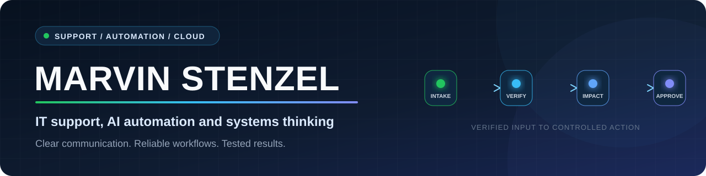

<!-- GitHub profile README for Mvstnz -->

  

  
  
  

## Hallo, ich bin Marvin

Ich verbinde fast 11 Jahre kundenorientierte Berufspraxis, darunter mehrere Jahre Führung von 15 bis 20 Mitarbeitenden, mit einer abgeschlossenen Weiterbildung in Linux, Cloud Engineering und IT-Support. Heute entwickle und prüfe ich technische Lösungen mit einem klaren Schwerpunkt auf Support, Automatisierung und verantwortungsvollem KI-Einsatz.

Dabei geht es mir nicht um möglichst viel Technik, sondern um Lösungen, die nachvollziehbar funktionieren: Anforderungen verstehen, Fehler systematisch eingrenzen, Abläufe sinnvoll strukturieren und Ergebnisse selbst testen.

> **Mein Arbeitsprinzip:** KI beschleunigt die Umsetzung. Anforderungen, Entscheidungen, Prüfung und Verantwortung bleiben beim Menschen.

## Ausgewählte Projekte

### [AI Production Incident Control](https://github.com/Mvstnz/ai-production-incident-control)

Ein vollständiges Portfolio-System für synthetische Lieferverzögerungen, Maschinenausfälle und Qualitätsprobleme. Zehn n8n-Workflows verbinden FastAPI, PostgreSQL, ein simuliertes ERP und ein React-Dashboard zu einem kontrollierten Incident-Prozess.

KI kann eingehende Informationen interpretieren und Texte vorbereiten. Fakten, Auswirkungen und Risikowerte werden deterministisch geprüft; folgenreiche Aktionen benötigen eine rollenbasierte Freigabe. Der lokale Gesamtprozess ist mit **108 Unit-Tests**, **34 Integrationstests** und **10 von 10 n8n-Laufzeitszenarien** belegt.

`n8n` · `FastAPI` · `PostgreSQL` · `React/TypeScript` · `Docker Compose` · `Gemini`

_Eigenes, KI-gestützt umgesetztes Portfolio-Projekt mit ausschließlich synthetischen Daten. Die lokale Demo ist getestet; eine produktive ERP- oder Cloud-End-to-End-Anbindung wird nicht behauptet._

### [Faden Pflegetools](https://faden-pflegetools.de/)

Ich habe Faden Pflegetools KI-gestützt mitentwickelt. Mein Beitrag umfasst das Ausarbeiten von Anforderungen und Abläufen, die Prüfung generierten Codes, Funktionstests und die iterative Verbesserung der Anwendung.

Die browserbasierte Lösung unterstützt unter anderem Pflegedokumentation, Dokumenterstellung und eine lokale Whisper-basierte Diktatfunktion. Fachliche Ergebnisse bleiben Entwürfe, die von verantwortlichen Pflegefachkräften geprüft und freigegeben werden.

`Next.js/React` · `Supabase` · `Dokumentgenerierung` · `Whisper/ONNX im Browser`

## Weitere Projekte

| Projekt | Was es zeigt |
| --- | --- |
| [IT Application Workflow](https://github.com/Mvstnz/it-application-workflow) | Datenschutzorientierter, wiederaufnehmbarer Workflow für beleggestützte Bewerbungsunterlagen mit Python, SQLite und harten Qualitätsprüfungen |
| [Event Planner auf AWS](https://github.com/Mvstnz/praxisphase-event-planner) | Teamprojekt mit FastAPI, PostgreSQL, Docker, AWS, Terraform, GitHub Actions und externer Ticketmaster-API |
| [Business Card LinkedIn](https://github.com/Mvstnz/business-card-linkedin) | Open-Source-Codex-Skill für Visitenkarten, vCard/CSV/JSON-Export, LinkedIn-Matching und kontrollierte Kontaktanfragen |
| [Skincare Marketing System](https://github.com/Mvstnz/marketing-system) | Geführte KI-Workflows für markenkonforme Posts, Newsletter, Produkttexte und Content-Pläne |

## Wie ich arbeite

- Probleme zuerst reproduzieren und das erwartete Verhalten festhalten
- Logs, API-Antworten, Statuscodes, Datenbankzustand und einzelne Workflow-Schritte gezielt prüfen
- Anforderungen und Systemstruktur selbst definieren; KI-Coding-Agenten bewusst für Umsetzung und Debugging einsetzen
- Änderungen lesen, testen und bei Bedarf durch eine zweite Prüfung absichern
- Lösungen dokumentieren und in wiederholbare Abläufe überführen
- Technische Zusammenhänge verständlich erklären und Eskalationen ruhig bearbeiten

## Technisches Profil

| Bereich | Praxis und Grundlagen |
| --- | --- |
| Support & Betrieb | Strukturierte Fehleranalyse, Dokumentation, Kundenkommunikation, Eskalationen, Ticket-/ITIL-Grundlagen |
| Automatisierung & KI | n8n, Codex, Claude Code, Prompting, geführte Workflows, KI-gestützte Implementierung und Review |
| Systeme & Cloud | Linux-Grundlagen, Bash, Git/GitHub, Docker-Grundlagen, AWS-Grundlagen, GitHub Actions und CI/CD-Grundlagen |
| Entwicklung & Daten | Python-Grundlagen, REST-Schnittstellen, relationale Datenbanken sowie PostgreSQL im Projektkontext |

## Qualifikationen

- Agile Softwareentwicklung mit Fokus auf Linux und Cloud Engineering, Syntax Institut
- IT-Support-Specialist IHK
- IT-Administrator IHK
- Cloud Business Expert IHK
- Linux Essentials
- AI Fluency: Framework & Foundations, Anthropic

Aktuell in Vorbereitung: AWS Certified Cloud Practitioner.

## Berufliche Substanz

- Fast 11 Jahre Kundenkommunikation, Reklamationen und lösungsorientierte Eskalationen
- Mehrjährige Führungserfahrung mit Einsatzplanung und Verantwortung für 15 bis 20 Mitarbeitende
- Prozesssteuerung, Kennzahlenanalyse, Dokumentation und Qualitätssicherung
- Belastbarkeit, schnelle Auffassung und verlässliche Teamkommunikation

## Wofür ich offen bin

Ich suche eine vollständig remote ausgeübte Einstiegsrolle im **IT-Support**, **Service Desk**, **Application Support** oder in der **IT-Administration**. Besonders interessant finde ich Aufgaben, bei denen technische Problemlösung, verständliche Kommunikation und sinnvolle Automatisierung zusammenkommen.

Deutsch: Muttersprache · Englisch: B1 bis B2

  
  

