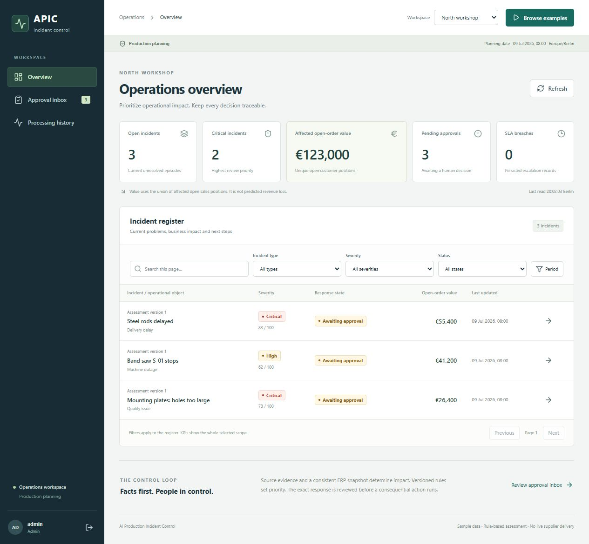
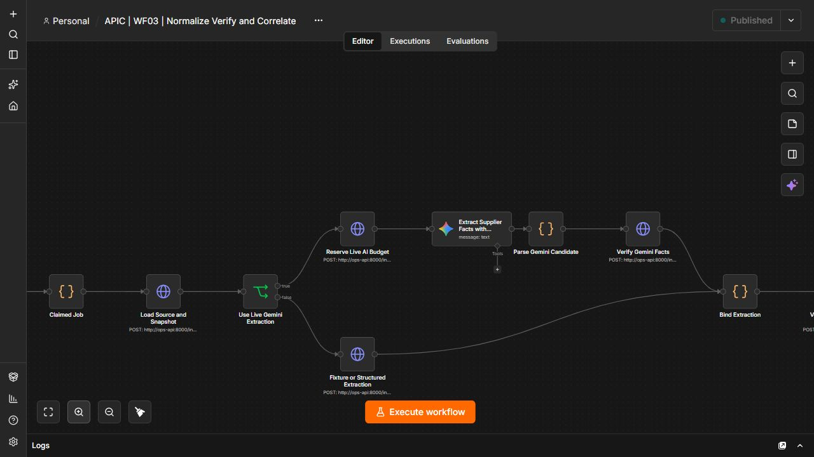

<!-- GitHub profile README for Mvstnz -->

  

  
  
  

## Hallo, ich bin Marvin

Ich verbinde fast 11 Jahre kundenorientierte Berufspraxis, darunter mehrere Jahre Führung von 15 bis 20 Mitarbeitenden, mit einer abgeschlossenen Weiterbildung in Linux, Cloud Engineering und IT-Support. Heute entwickle und prüfe ich technische Lösungen mit einem klaren Schwerpunkt auf Support, Automatisierung und verantwortungsvollem KI-Einsatz.

Dabei geht es mir nicht um möglichst viel Technik, sondern um Lösungen, die nachvollziehbar funktionieren: Anforderungen verstehen, Fehler systematisch eingrenzen, Abläufe sinnvoll strukturieren und Ergebnisse selbst testen.

> **Mein Arbeitsprinzip:** KI beschleunigt die Umsetzung. Anforderungen, Entscheidungen, Prüfung und Verantwortung bleiben beim Menschen.

## Ausgewählte Projekte

### [AI Production Incident Control](https://github.com/Mvstnz/ai-production-incident-control)

**[Live-Demo öffnen](https://ai-production-incident-control-dash.vercel.app)** · Besucher können den geteilten Arbeitsbereich ohne Login lesend ansehen.

Das System führt eine gemeldete Produktionsstörung von der eingehenden Meldung über eine geprüfte Auswirkungsbewertung und eine menschliche Freigabe bis zu einer nachvollziehbaren Aktion im simulierten ERP. Zehn n8n-Workflows verbinden ein React-Dashboard, FastAPI und PostgreSQL zu einem kontrollierten Incident-Prozess. Alle Firmen, Aufträge, Prüfungen und Betriebsdaten sind erfunden.

Drei alltägliche Fertigungsfälle sind hinterlegt: verspätete Stahlstangen (83/100, kritisch), eine ausgefallene Bandsäge (62/100, hoch) und Montageplatten mit zu großen Bohrungen (70/100, kritisch).

KI kann eingehende Meldungen interpretieren und Texte vorbereiten. Fakten, Auswirkungen und Risikowerte werden deterministisch berechnet und gegen den ERP-Stand geprüft; folgenreiche Aktionen benötigen eine rollenbasierte Freigabe, die genau an Planversion, Hash, Empfänger, Text und Befehlsparameter gebunden ist.

| Gehostetes Dashboard | Einer von zehn Workflows: WF03 „Normalize, Verify and Correlate“ |
| --- | --- |
|  |  |

**Die zehn Workflows** decken den Ablauf getrennt voneinander ab: E-Mail-Eingang · API- und Formulareingang · Normalisieren, Prüfen und Korrelieren · ERP-Auswirkungsanalyse · Risikoerklärung und Aktionsplan · Menschliche Freigabe · Aktionsausführung · SLA-Versand und Wiederaufnahme · Fehler- und Dead-Letter-Behandlung · Tägliches Management-Digest. Jeder Schritt ist einzeln nachvollziehbar und einzeln prüfbar.

**Betrieb:** Vercel (Dashboard und API) · Supabase PostgreSQL in Frankfurt mit privaten `ops`- und `erp`-Schemas · n8n Cloud mit allen zehn veröffentlichten Workflows.

**Nachweise:** 112 Unit-Tests, 34 API-Integrationstests, 10 von 10 lokalen n8n-Laufzeitszenarien, 10 Resilienz-Szenarien, 50 deterministische Auswertungsfälle sowie protokollierte Läufe gegen die gehostete Umgebung inklusive eines echten Gemini-Durchlaufs.

`n8n` · `FastAPI` · `PostgreSQL/Supabase` · `React/TypeScript` · `Docker Compose` · `Vercel` · `Gemini`

_Eigenes, KI-gestützt umgesetztes Portfolio-Projekt mit ausschließlich synthetischen Daten. Lieferanten-Mails werden in der Datenbank erfasst und nicht an reale Empfänger versendet; Umplanungen und Sperren wirken nur im simulierten ERP. Der ausgewiesene Auftragswert bezeichnet betroffenes Volumen, keine Verlustprognose. Die verbundene n8n-Instanz läuft in einem Trial-Konto, davon hängt die dauerhafte Erreichbarkeit ab._

### [Faden Pflegetools](https://faden-pflegetools.de/)

Ich habe Faden Pflegetools KI-gestützt mitentwickelt. Mein Beitrag umfasst das Ausarbeiten von Anforderungen und Abläufen, die Prüfung generierten Codes, Funktionstests und die iterative Verbesserung der Anwendung.

Die browserbasierte Lösung unterstützt unter anderem Pflegedokumentation, Dokumenterstellung und eine lokale Whisper-basierte Diktatfunktion. Fachliche Ergebnisse bleiben Entwürfe, die von verantwortlichen Pflegefachkräften geprüft und freigegeben werden.

`Next.js/React` · `Supabase` · `Dokumentgenerierung` · `Whisper/ONNX im Browser`

## Weitere Projekte

| Projekt | Was es zeigt |
| --- | --- |
| [IT Application Workflow](https://github.com/Mvstnz/it-application-workflow) | Datenschutzorientierter, wiederaufnehmbarer Workflow für beleggestützte Bewerbungsunterlagen mit Python, SQLite und harten Qualitätsprüfungen |
| [Event Planner auf AWS](https://github.com/Mvstnz/praxisphase-event-planner) | Teamprojekt mit FastAPI, PostgreSQL, Docker, AWS, Terraform, GitHub Actions und externer Ticketmaster-API |
| [Business Card LinkedIn](https://github.com/Mvstnz/business-card-linkedin) | Open-Source-Codex-Skill für Visitenkarten, vCard/CSV/JSON-Export, LinkedIn-Matching und kontrollierte Kontaktanfragen |
| [Skincare Marketing System](https://github.com/Mvstnz/marketing-system) | Geführte KI-Workflows für markenkonforme Posts, Newsletter, Produkttexte und Content-Pläne |

## Wie ich arbeite

- Probleme zuerst reproduzieren und das erwartete Verhalten festhalten
- Logs, API-Antworten, Statuscodes, Datenbankzustand und einzelne Workflow-Schritte gezielt prüfen
- Anforderungen und Systemstruktur selbst definieren; KI-Coding-Agenten bewusst für Umsetzung und Debugging einsetzen
- Änderungen lesen, testen und bei Bedarf durch eine zweite Prüfung absichern
- Lösungen dokumentieren und in wiederholbare Abläufe überführen
- Technische Zusammenhänge verständlich erklären und Eskalationen ruhig bearbeiten

## Technisches Profil

| Bereich | Praxis und Grundlagen |
| --- | --- |
| Support & Betrieb | Strukturierte Fehleranalyse, Dokumentation, Kundenkommunikation, Eskalationen, Ticket-/ITIL-Grundlagen |
| Automatisierung & KI | n8n, Codex, Claude Code, Prompting, geführte Workflows, KI-gestützte Implementierung und Review |
| Systeme & Cloud | Linux-Grundlagen, Bash, Git/GitHub, Docker-Grundlagen, AWS-Grundlagen, GitHub Actions und CI/CD-Grundlagen |
| Entwicklung & Daten | Python-Grundlagen, REST-Schnittstellen, relationale Datenbanken sowie PostgreSQL im Projektkontext |

## Qualifikationen

- Agile Softwareentwicklung mit Fokus auf Linux und Cloud Engineering, Syntax Institut
- IT-Support-Specialist IHK
- IT-Administrator IHK
- Cloud Business Expert IHK
- Linux Essentials
- AI Fluency: Framework & Foundations, Anthropic

Aktuell in Vorbereitung: AWS Certified Cloud Practitioner.

## Berufliche Substanz

- Fast 11 Jahre Kundenkommunikation, Reklamationen und lösungsorientierte Eskalationen
- Mehrjährige Führungserfahrung mit Einsatzplanung und Verantwortung für 15 bis 20 Mitarbeitende
- Prozesssteuerung, Kennzahlenanalyse, Dokumentation und Qualitätssicherung
- Belastbarkeit, schnelle Auffassung und verlässliche Teamkommunikation

## Wofür ich offen bin

Ich suche eine vollständig remote ausgeübte Einstiegsrolle im **IT-Support**, **Service Desk**, **Application Support** oder in der **IT-Administration**. Besonders interessant finde ich Aufgaben, bei denen technische Problemlösung, verständliche Kommunikation und sinnvolle Automatisierung zusammenkommen.

Deutsch: Muttersprache · Englisch: B1 bis B2

  
  

